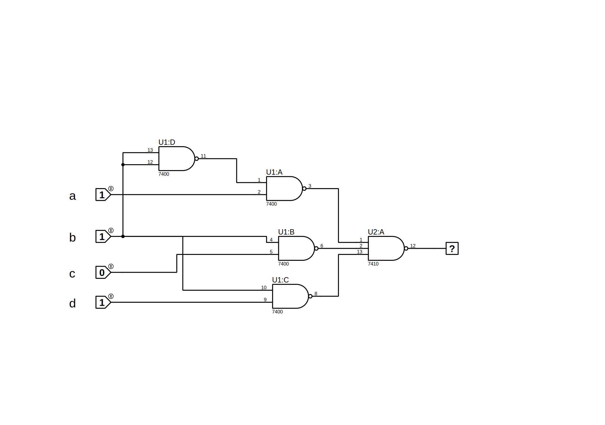
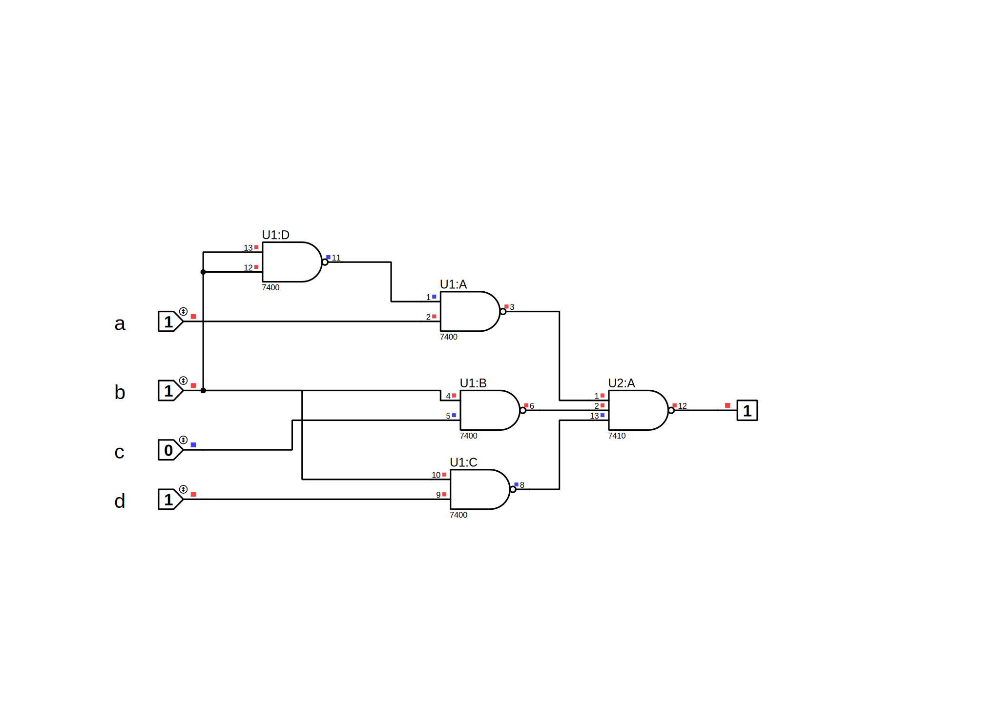

# Design Example

## Steps

1. Obtain the truth table of the circuit.

2. Simplify the output function.

3. Draw the logic diagram of the circuit, using NAND gates with a minimum number of ICs.

4. Construct the circuit and test it for proper operation by verifying the given conditions.

##  one : Truth Table
    | A | B | C | D | F |
    |---|---|---|---|---|
    | 0 | 0 | 0 | 0 | 0 |
    | 0 | 0 | 0 | 1 | 0 |
    | 0 | 0 | 1 | 0 | 0 |
    | 0 | 0 | 1 | 1 | 0 |
    | 0 | 1 | 0 | 0 | 0 |
    | 0 | 1 | 0 | 1 | 1 |
    | 0 | 1 | 1 | 0 | 1 |
    | 0 | 1 | 1 | 1 | 1 |
    | 1 | 0 | 0 | 0 | 1 |
    | 1 | 0 | 0 | 1 | 1 |
    | 1 | 0 | 1 | 0 | 1 |
    | 1 | 0 | 1 | 1 | 1 |
    | 1 | 1 | 0 | 0 | 0 |
    | 1 | 1 | 0 | 1 | 1 |
    | 1 | 1 | 1 | 0 | 1 |
    | 1 | 1 | 1 | 1 | 1 |

##  two : Simply Truth Table
    |        | c,d 00 | 01 | 11 | 10 |
    |:------:|:------:|:--:|:--:|:--:|
    | a,b 00 |    0   |  0 |  0 |  0 |
    |   01   |    0   |  1 |  1 |  1 |
    |   11   |    0   |  1 |  1 |  1 |
    |   10   |    1   |  1 |  1 |  1 |

	f(a, b, c, d) = bd + bc + ab' // logic
    
##  three : circuit schematic

##  four : circuit schematic test

