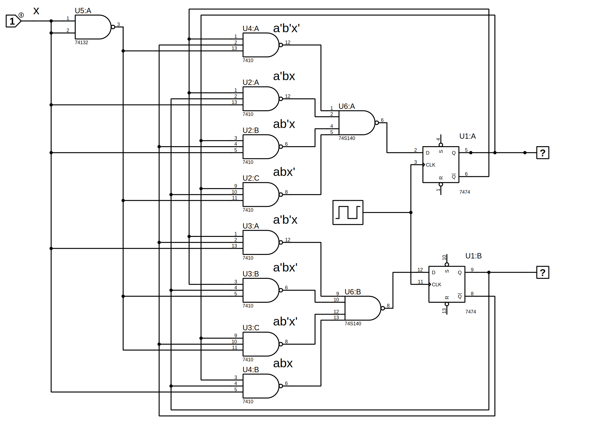
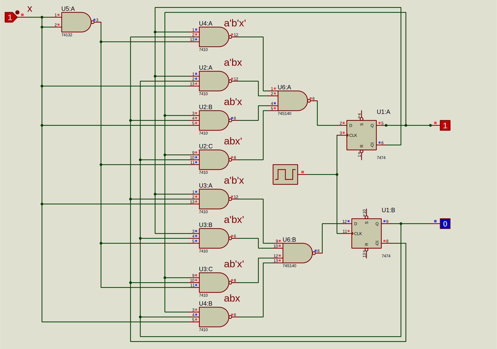

# State Diagram
      Design, construct, and test a sequential circuit whose state diagram is shown in Figure 9.14.
      Set the two flips to A and B, the input to x, and the output to y.
      Connect the output of the lowest flip-flop B to input x and predict its value
      Sequence of states and outputs that occur using clock pulses. confirm
      Transmission and output mode with circuit test
	  
## Truth Table

| A | B | x | DA | DB | y |
|:-:|:-:|:-:|:--:|:--:|:-:|
| 0 | 0 | 0 |  0 |  1 | 0 |
| 0 | 1 | 0 |  1 |  0 | 1 |
| 1 | 0 | 0 |  0 |  0 | 1 |
| 1 | 1 | 0 |  1 |  1 | 0 |
| 0 | 0 | 1 |  0 |  0 | 1 |
| 0 | 1 | 1 |  1 |  1 | 0 |
| 1 | 0 | 1 |  0 |  1 | 0 |
| 1 | 1 | 1 |  1 |  0 | 1 |

## Proteus Circuit
    DA = b
    DB = a'b'x' + a'bx + ab'x + abx'
    y =  a'b'x + a'bx' + ab'x' + abx

## Proteus Circuit Test

	  
