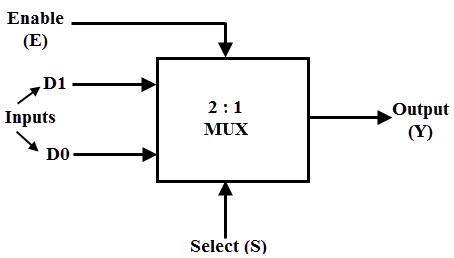
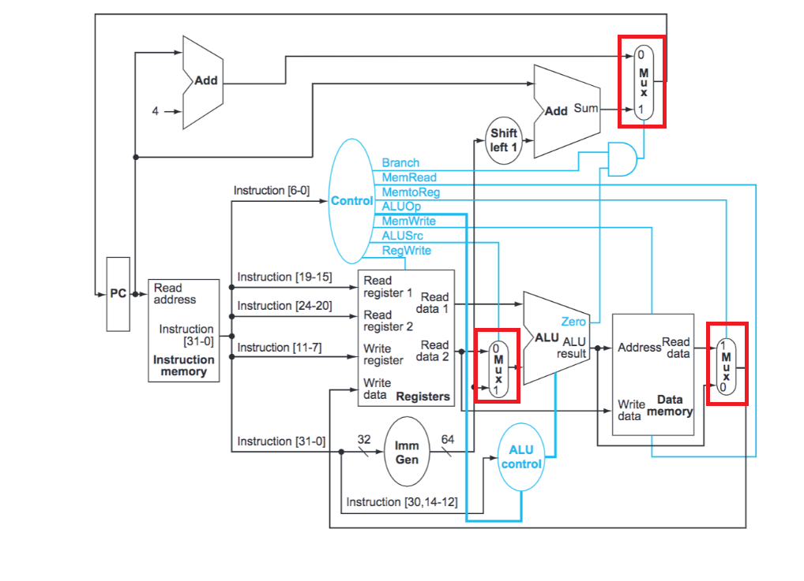

# Multiplexer Module in RISC-V

## Introduction
    In electronics, a multiplexer, also known as a data selector, is a device that selects between several analog or digital input signals and forwards the selected input to a single output line. The selection is directed a separate set of digital inputs known as select lines.
## Multiplexer circuit

## Multiplexer in RISC-V

