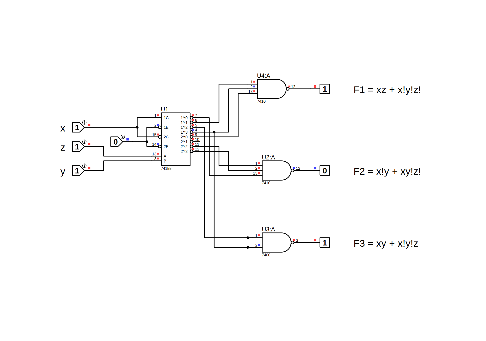

#   Generator

    Design circuit F1, F2, F3 with 74155 decoder
    - F1 = xz + x!y!z!
    - F2 = x!y + xy!z!
    - F3 = xy + x!y!z
	
##  Table
    | x | y | z | F1 | F2 | F3 |
    |---|---|---|----|----|----|
    | 0 | 0 | 0 | 1  | 0  | 1  |
    | 0 | 0 | 1 | 0  | 0  | 0  |
    | 0 | 1 | 0 | 0  | 1  | 0  |
    | 0 | 1 | 1 | 0  | 1  | 0  |
    | 1 | 0 | 0 | 0  | 1  | 0  |
    | 1 | 0 | 1 | 1  | 0  | 0  |
    | 1 | 1 | 0 | 0  | 0  | 1  |
    | 1 | 1 | 1 | 1  | 0  | 1  |
	
## Circuit Schematic

