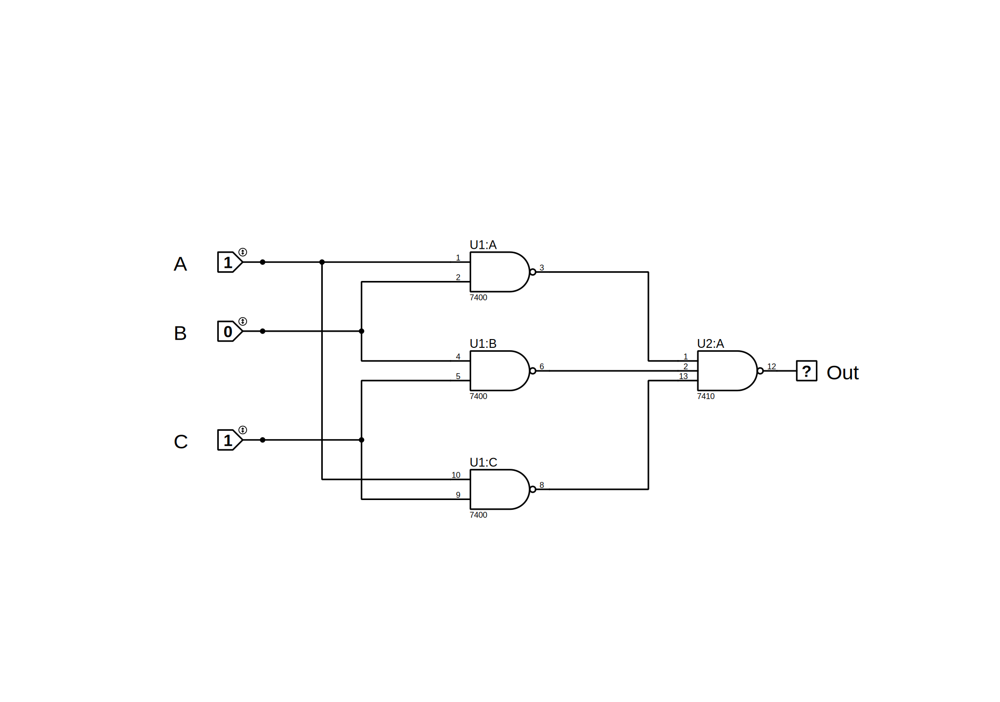

# Majority logic
## Introduction
    A majority logic is a digital circuit whose output is equal to 1 if the majority of the inputs are 1’s. The output is 0 otherwise.
## Truth Table
    | A | B | C | Out|
    |---|---|---|-----|
    | 0 | 0 | 0 | 0   |
    | 0 | 0 | 1 | 0   |
    | 0 | 1 | 1 | 1   |
    | 1 | 0 | 0 | 0   |
    | 1 | 0 | 1 | 1   |
    | 1 | 1 | 0 | 1   |
    | 1 | 1 | 1 | 1   |

## Circuit Schematic

