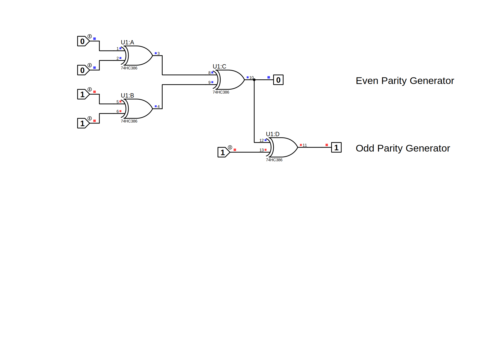

#  Parity Generator
## Introduction
### What is a Parity Bit & Parity Generator?
    A parity bit is an extra bit in any binary message to make the total number of 1’s either odd or even. We need to add the parity bit to a signal. This is done by the Parity generator.
### What is even parity and odd parity?
    Even parity is the case when the total number of 1s in the sum of data bits and parity bits is even whereas, in odd parity, it is odd.

## Truth Table
    | A | B | C | D | Even | Odd |
    |---|---|---|---|------|-----|
    | 0 | 0 | 0 | 0 | 0    | 1   |
    | 0 | 0 | 0 | 1 | 1    | 0   |
    | 0 | 0 | 1 | 0 | 1    | 0   |
    | 0 | 0 | 1 | 1 | 0    | 1   |
    | 0 | 1 | 0 | 0 | 1    | 0   |
    | 0 | 1 | 0 | 1 | 0    | 1   |
    | 0 | 1 | 1 | 0 | 0    | 1   |
    | 0 | 1 | 1 | 1 | 1    | 0   |
    | 1 | 0 | 0 | 0 | 1    | 0   |
    | 1 | 0 | 0 | 1 | 0    | 1   |
    | 1 | 0 | 1 | 0 | 0    | 1   |
    | 1 | 0 | 1 | 1 | 1    | 0   |
    | 1 | 1 | 0 | 0 | 0    | 1   |
    | 1 | 1 | 0 | 1 | 1    | 0   |
    | 1 | 1 | 1 | 0 | 1    | 0   |
    | 1 | 1 | 1 | 1 | 0    | 1   |

## Circuit Schematic
 
we can use xor gate with bit 1 to make not gate.

