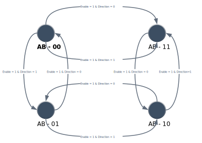

# Up/Down Counter with Enable
	 Design, build, and test a two-bit counter that counts up or down. Input Input E
     Determines whether the counter is on or off. If E = 0, the counter is deactivated and remains
     In the current count even if the clock pulses are applied to the flip-flop. If E = 1,
     The counter is active and the second input, x, sets the counting direction. If x = 1,
     The circuit is counted upwards with sequences 00, 01, 10, 11 and the number is repeated. If x = 0,
     Circuits with sequences 11, 10, 01, 00 are counted down and the number is repeated. do
     Do not use E to turn off the clock. Design the sequential circuit with E and x as inputs.
	 
## Machine State Diagram 

	 
## Truth Table 

| A | B | Enable | Direction | DA | DB |
|:-:|:-:|:------:|:---------:|:--:|:--:|
| 0 | 0 |    0   |     x     |  0 |  0 |
| 0 | 0 |    1   |     0     |  0 |  1 |
| 0 | 0 |    1   |     1     |  1 |  1 |
| 0 | 1 |    0   |     x     |  0 |  1 |
| 0 | 1 |    1   |     0     |  1 |  0 |
| 0 | 1 |    1   |     1     |  0 |  0 |
| 1 | 0 |    0   |     x     |  1 |  0 |
| 1 | 0 |    1   |     0     |  1 |  1 |
| 1 | 0 |    1   |     1     |  0 |  1 |
| 1 | 1 |    0   |     x     |  1 |  1 |
| 1 | 1 |    1   |     0     |  0 |  0 |
| 1 | 1 |    1   |     1     |  1 |  0 |
	 
	 